# Laravel Octane Example for dPanel

This repository is a Laravel application prepared for dPanel deployment with
Laravel Octane and FrankenPHP. It is designed to be onboarded from GitHub, built
on the target server, and run as a systemd service managed by dPanel.

The dPanel onboarding flow below was captured from the **Development** workspace
using server **422674e9b405**.

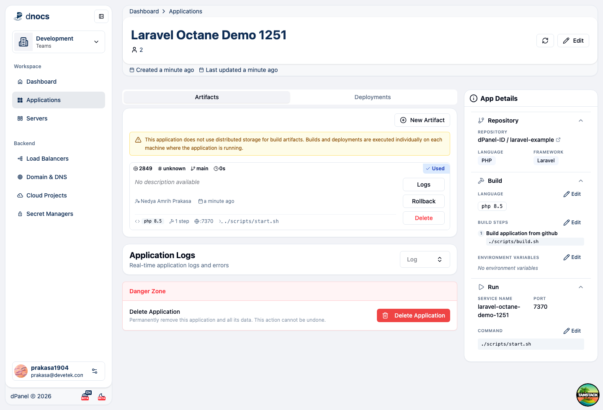

## Stack

- Laravel 13
- Inertia React
- Vite
- Laravel Octane
- FrankenPHP
- SQLite by default
- External database support through environment variables

## dPanel Runtime Requirements

Select these dependencies while creating the application in dPanel:

- PHP `8.5`
- FrankenPHP

The application build also uses Composer and a JavaScript package manager. The
provided build script installs PHP dependencies, frontend dependencies, builds
assets, prepares Laravel writable directories, and optimizes the app.

Important: the target Linux package repository must provide the selected PHP
packages. During the captured Development test, dPanel created the application
record successfully, but deployment stopped because the selected VM could not
install `php8.5-opcache` from its configured package sources.

## Commands

Use these values in dPanel when configuring the application.

Build command:

```bash
./scripts/build.sh
```

Runtime command:

```bash
./scripts/start.sh
```

Application port:

```text
Choose any available port suggested by dPanel.
```

`scripts/start.sh` reads the port from dPanel's `PORT` variable. If `PORT` is
missing, it falls back to `APP_PORT`, then `8000`.

## dPanel Onboarding

### 1. Select the Repository

Open **Applications**, create a new application, then select the GitHub
repository:

```text
dPanel-ID/laravel-example
```

The repository is under the `dPanel-ID` GitHub organization. In the captured
flow it appeared on page 3 of the repository picker.

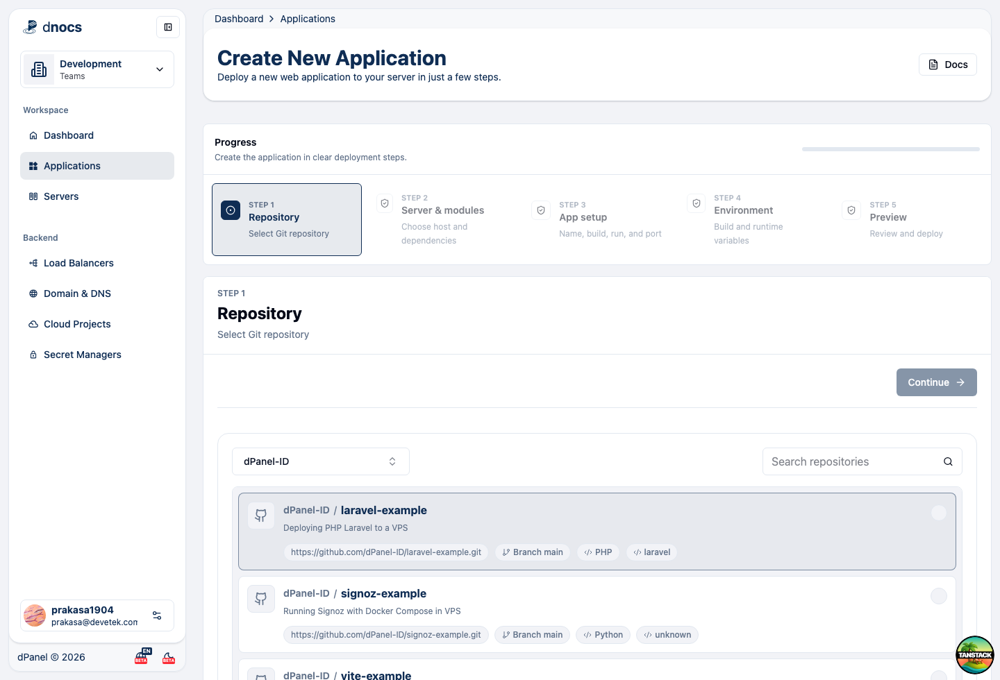

After selecting the repository, continue to the server step.

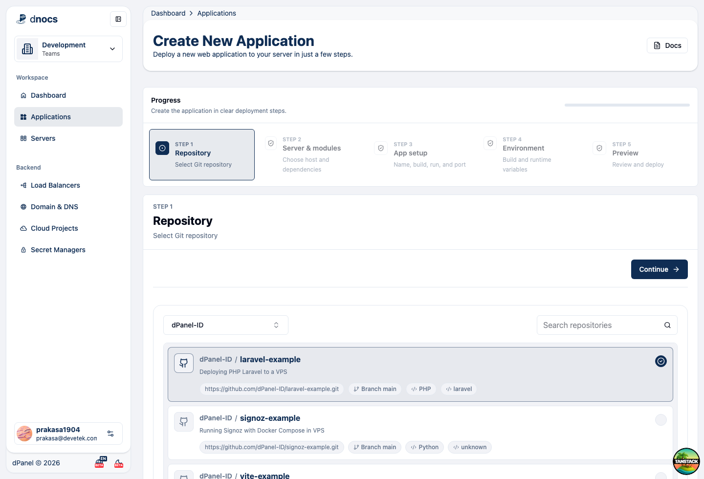

### 2. Select the Server

Select server:

```text
422674e9b405
```

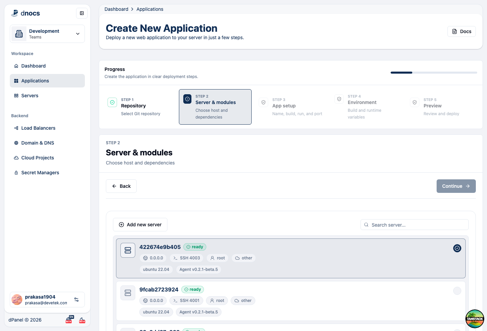

### 3. Add PHP 8.5

From **Install dependencies**, add **PHP** and set the PHP version to `8.5`.

Use these matching PHP-FPM values when the form exposes them:

```text
PHP binary prefix: php8.5
PHP version: 8.5
PHP-FPM socket: /var/run/php8.5-fpm.sock
```

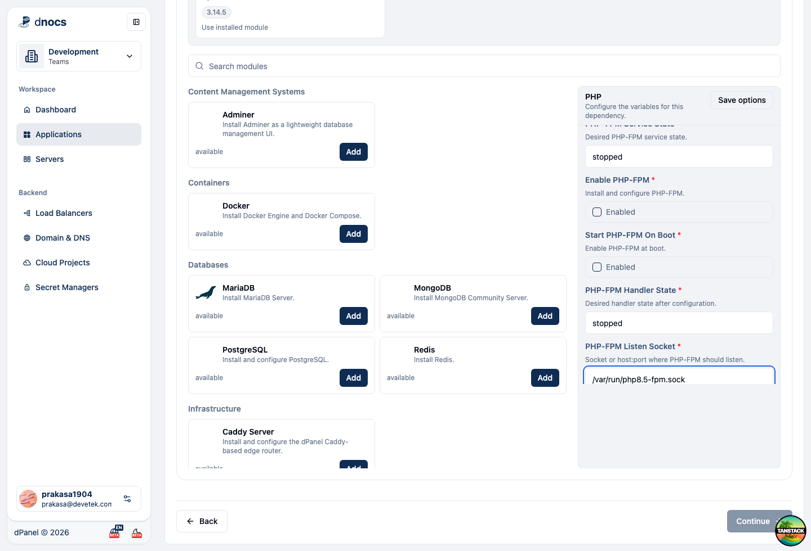

### 4. Add FrankenPHP

Add **FrankenPHP** from the dependency list and keep the default values unless
your server requires a custom version.

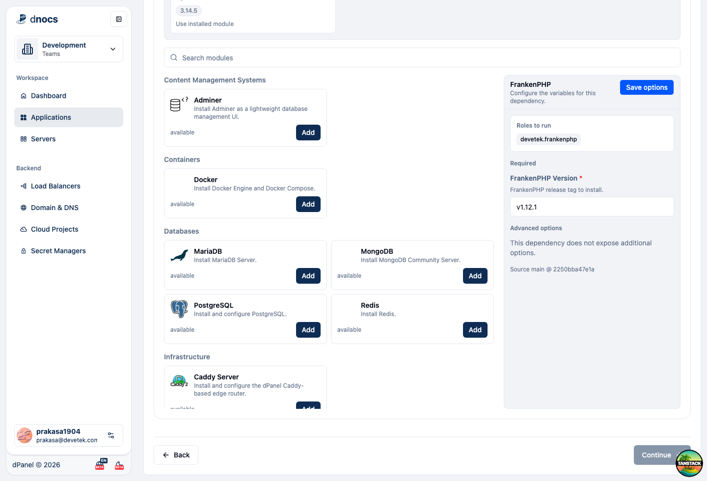

After both dependencies are selected, continue to application setup.

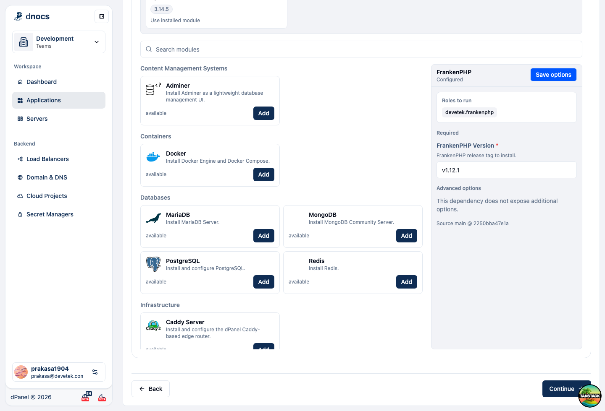

### 5. Configure Build and Runtime

Set the application name, then choose the build and runtime scripts from the
repository file picker.

Build script:

```text
scripts/build.sh
```

Runtime script:

```text
scripts/start.sh
```

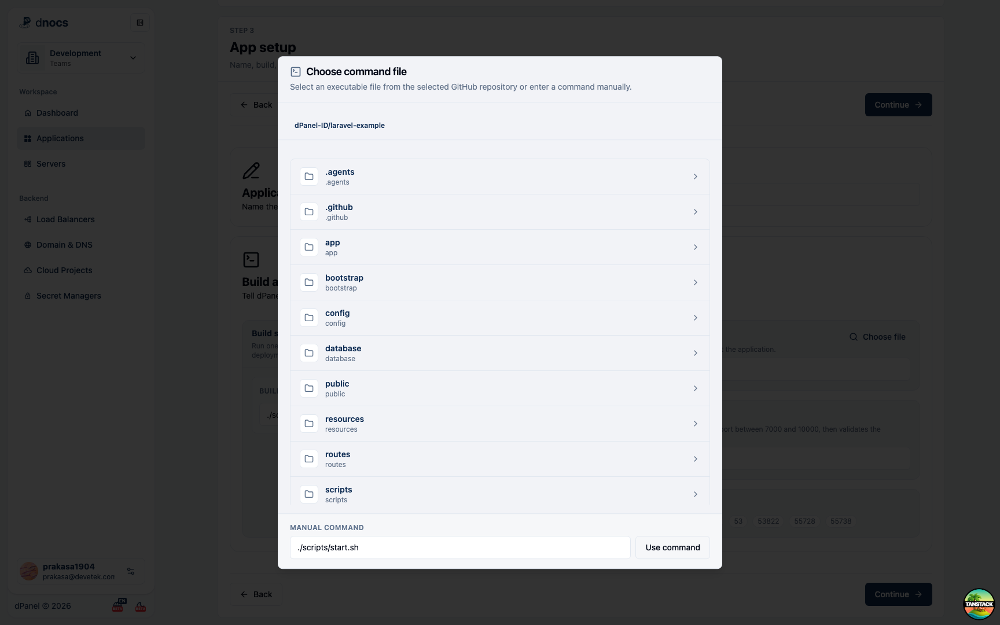

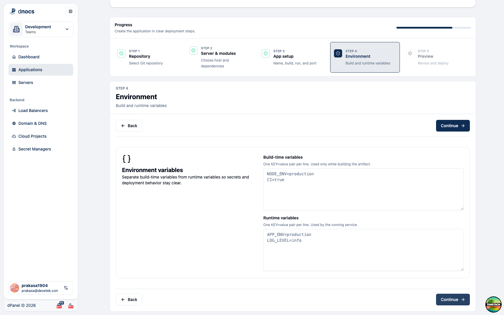

dPanel will pick a random available port in the safe application range. In the
captured flow, dPanel selected port `7370`.

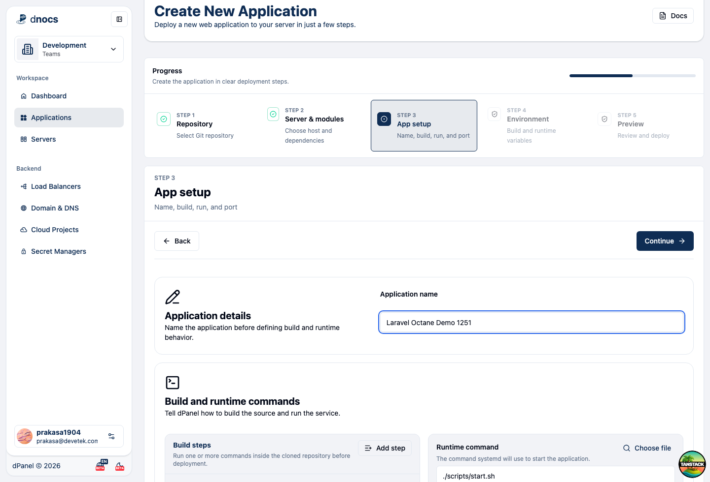

### 6. Environment Variables

The default app can deploy without extra variables. For production, these values
are recommended:

```dotenv
APP_ENV=production
APP_DEBUG=false
OCTANE_SERVER=frankenphp
OCTANE_WORKERS=auto
OCTANE_MAX_REQUESTS=500
DPANEL_RUN_MIGRATIONS=true
LOG_CHANNEL=stderr
LOG_STACK=stderr
LOG_DEPRECATIONS_CHANNEL=stderr
```

Set `APP_URL` after routing or a load balancer is configured:

```dotenv
APP_URL=https://example.com
```

For MySQL or MariaDB:

```dotenv
DB_CONNECTION=mysql
DB_HOST=127.0.0.1
DB_PORT=3306
DB_DATABASE=laravel
DB_USERNAME=laravel
DB_PASSWORD=change-me
```

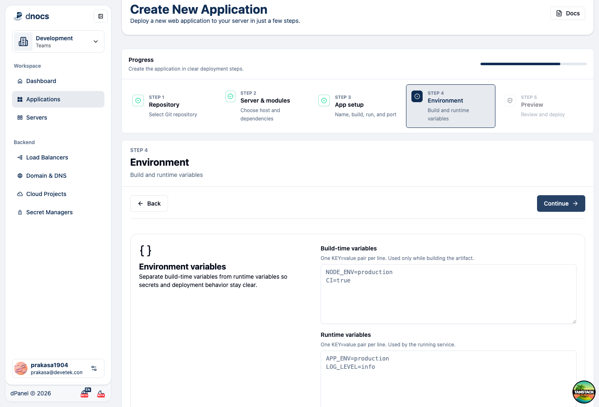

### 7. Preview and Deploy

Review the final preview, then click **Deploy**.

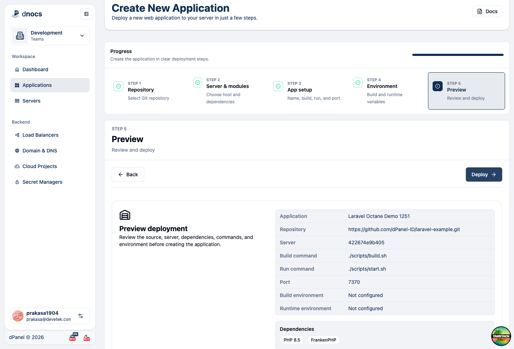

dPanel creates:

- An application record
- A build artifact record
- A deployment record
- An application-specific IaC playbook
- A systemd service when deployment completes

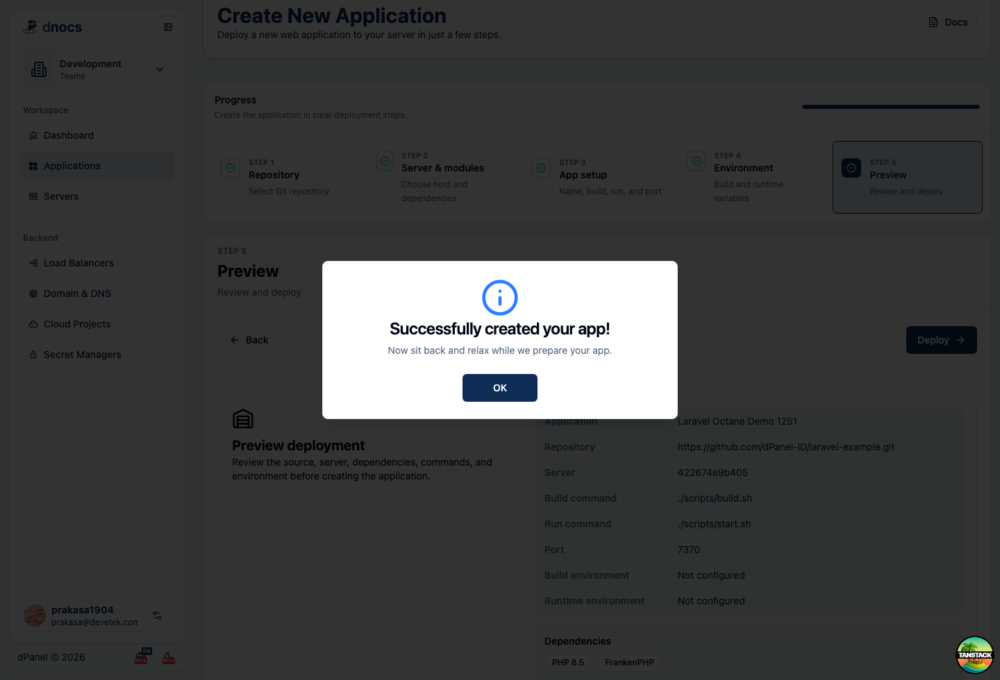

## Script Behavior

### `scripts/build.sh`

The build script prepares Laravel for production:

- Copies `.env.example` to `.env` when `.env` is missing.
- Creates Laravel writable directories.
- Creates the SQLite database file when SQLite is configured.
- Installs Composer dependencies without dev packages.
- Generates `APP_KEY` when needed.
- Installs Octane for FrankenPHP.
- Installs frontend dependencies with `pnpm`, `npm`, or `yarn`.
- Builds frontend assets with Vite.
- Runs migrations when `DPANEL_RUN_MIGRATIONS=true`.
- Defaults Laravel logs and deprecations to `stderr` before caching config.
- Optimizes Laravel caches.

### `scripts/start.sh`

The runtime script starts Laravel Octane with FrankenPHP:

```bash
php artisan octane:frankenphp --host="${HOST}" --port="${PORT}"
```

It binds to `0.0.0.0`, reads `PORT` from dPanel, and keeps the process in the
foreground so systemd can manage the service.

Laravel application logs default to `stderr`, and PHP runtime errors are sent to
`/dev/stderr`. Octane and FrankenPHP normal output remains on the process
standard streams, so a systemd service can collect everything with the journal:

```ini
StandardOutput=journal
StandardError=journal
```

Use `journalctl -u <service-name> -f` to follow the deployed service logs.

## Local Test

Run the same commands locally before onboarding:

```bash
./scripts/build.sh
APP_PORT=9001 ./scripts/start.sh
```

Then open:

```text
http://127.0.0.1:9001
```

## Troubleshooting

### PHP 8.5 package is unavailable

If deployment fails with an error like:

```text
No package matching 'php8.5-opcache' is available
```

the server package repositories do not provide PHP 8.5 packages. Update the VM
package source used by the PHP module, or select a PHP version that is available
for that operating system until PHP 8.5 packages are present.

### Build fails

Check the deployment log in dPanel and confirm these tools are available after
dependency installation:

```bash
php -v
composer --version
npm --version
```

### Runtime starts but the page is blank

Check:

```text
storage/logs/laravel.log
```

Also confirm `APP_URL`, database variables, writable directories, and the dPanel
service port.

### Port is already in use

Return to the application setup step and select another available port. dPanel
validates the selected server before continuing.
